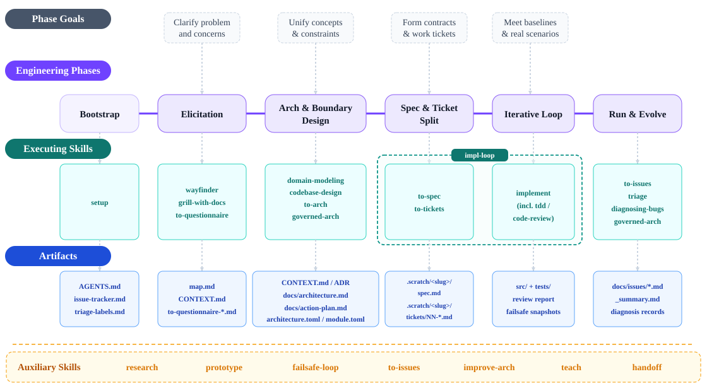

# agentic-se-framework

**agentic-se-framework** is a full-lifecycle software engineering methodology and governance framework for LLM-agent-assisted development. It covers the complete engineering pipeline from requirements clarification and concept abstraction through Architecture-as-Code constraint governance, spec contract generation, TDD implementation, code review, failure diagnosis, and the operations loop.

## Layout

- `core/`: framework core governance skills and architectural toolkits (e.g. `governed-arch`, `to-arch`, `failsafe-loop`, `md-to-html`, `to-issues`)
- `vendor/mattpocock/local/skills/`: adapted engineering derivatives maintained for the framework workflow
- `vendor/mattpocock/local/upstream_lock.toml`: tracked upstream commit and per-skill mapping baseline
- `vendor/mattpocock/upstream/`: local upstream tracking clone for `mattpocock/skills` (gitignored)
- `manifests/`: TOML manifests describing framework skills and install targets (`install-targets.example.toml` is the tracked template; your local `install-targets.toml` is gitignored)
- `ops/`: operational scripts for multi-target install, diff, hotfix capture, and upstream sync
- `docs/`: architecture specifications, methodology panorama, and templates
- `logs/`: generated deployment backups and reports

## Getting Started

1. Clone the repository.
2. Create your machine-specific deploy targets from the template:

   ```powershell
   Copy-Item manifests/install-targets.example.toml manifests/install-targets.toml
   ```

   Then edit `manifests/install-targets.toml` to point at real skill directories on your machine. This file is personal and gitignored; never commit it.
3. Publish skills to all enabled targets:

   ```powershell
   ./ops/install.ps1
   ```

## Working Model

1. Edit skills in this framework workspace, not in IDE install directories.
2. Treat target environments (Trae, Antigravity, etc.) as deployment targets only.
3. Sync upstream changes into `vendor/mattpocock/upstream/` when needed.
4. Keep adapted derivatives under `vendor/mattpocock/local/skills/` with paths mirroring upstream.
5. Update `vendor/mattpocock/local/upstream_lock.toml` when upstream baseline changes.
6. Publish skills from this framework to all enabled targets with `ops/install.ps1`.

## Credits & Acknowledgments

- Foundational engineering skills inspiration & derivatives: [mattpocock/skills](https://github.com/mattpocock/skills)
- Original methodology, Architecture-as-Code governance (`governed-arch`), dual issue stream tracking (`to-issues`/`to-tickets`), failsafe engineering loops (`failsafe-loop`), and multi-target deployment automation are developed and maintained as part of this framework.

## Panorama

Interactive bilingual skill panorama (rendered on GitHub Pages from `docs/html/`):

- English: <https://doubleelec.github.io/agentic-se-framework/html/new_project_skill_panorama.en.html>
- Chinese: <https://doubleelec.github.io/agentic-se-framework/html/new_project_skill_panorama.zh.html>

Static snapshot (English):



Sources: [docs/new_project_skill_panorama.en.md](docs/new_project_skill_panorama.en.md) · [docs/new_project_skill_panorama.zh.md](docs/new_project_skill_panorama.zh.md)

## Community

- Code of Conduct: [CODE_OF_CONDUCT.md](CODE_OF_CONDUCT.md)
- Contributing guide: [CONTRIBUTING.md](CONTRIBUTING.md)
- Bilingual docs parity check: `ops/check_bilingual.ps1`

## License

Released under the [MIT License](LICENSE). The skills under `vendor/mattpocock/local/` are modifications of [mattpocock/skills](https://github.com/mattpocock/skills) (MIT); see the third-party notice in [LICENSE](LICENSE).
