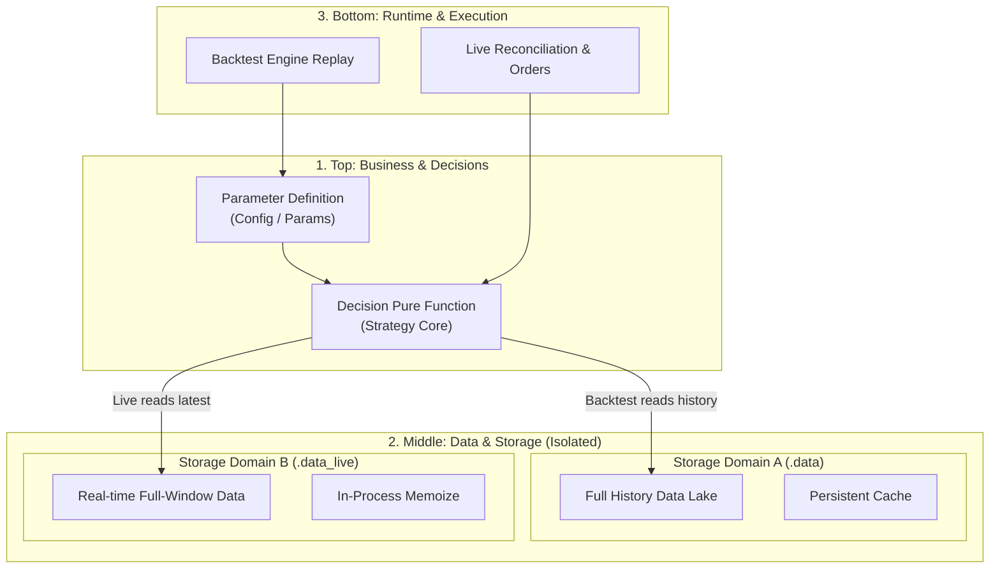
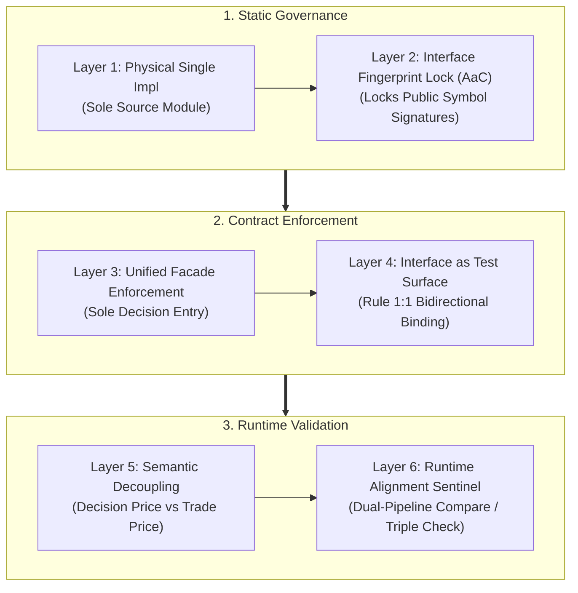

# MD Diagram (Markdown Diagram Layout & Structural Matrix Guide)

A diagram exists to make complex architecture immediately legible. **Predictability in layout** and **visual breathability** are the core virtues: a diagram must render elegantly on GitHub, in IDE previews, and inside HTML exports without shrinking into unreadable strips or blowing up into giant square blocks.

This skill covers two complementary diagramming scenarios:

1. **Mermaid chart rules**: agile rendering for standard flow, sequence, gantt, and lightweight graph charts.
2. **Hand-written structural-matrix SVG**: when Mermaid syntax cannot express multi-dimensional alignment, cross-layer grids, or bottom support strips, hand-crafted embedded SVG breaks through the layout ceiling to produce structured panoramas.

---

## 1. Scenario One: Agile Mermaid Charts (The Seven Layout & Syntax Rules)

### 1.1 Subgraph Single-Line Rule

- **Engine limitation**: Mermaid allocates only a fixed single-line height (~20px) to `subgraph` titles and does not support auto-wrapping inside them. If a title is too long or contains multiple segments, it gets clipped vertically (CJK text is the worst case).
- **Rule**: a `subgraph` title must be a **short single line**, at most `$\le 10$` CJK characters (or equivalent).
- **Forbidden**: never put long parenthetical explanations in a `subgraph` title (e.g. `subgraph LayerMid["2. Middle: Data & Cache Isolation"]`). Move long explanations into **inner nodes** or **body text**.
- **Recommended**: `subgraph LayerShared["Shared Code Layer"]`; put the detail into the first inner node's label.

### 1.2 Edge Endpoint & Label Syntax

- **Edges must target real nodes**: when subgraphs are nested, arrow endpoints (`-->`, `-.->`, `==>`) **must connect to concrete entity nodes (Node IDs)**, never to a nested subgraph's frame ID (e.g. `A --> NestedSubgraphId`), otherwise Mermaid 11.16+ throws `Syntax error in text`.
- **No syntax mutations on edges**: the thick arrow supports only the standard `==>` / `==>|label|` / `== label ==>` forms. **Never** append extra equals signs (e.g. `====>` or `====>|...|` will error). Use `-->` for normal lines and `-.->` for dashed lines only.
- **Edge label text safety**: `|text|` labels must not contain unescaped bare parentheses `()`, command slashes `/`, or other special characters; use plain words and spaces (e.g. use `|live=False reads offline cache|` instead of `|live=False (reads offline cache)|`, and `|read-only link|` instead of `|mklink /J|`).

### 1.3 Label Safety & Entity Escaping

- **Two-line label convention**: when a node mixes CJK and Latin text or long phrases, use explicit `<br/>` line breaks and keep spaces at line edges and around parentheses (e.g. `TradeParams["Parameter Definition<br/>(TradeParams)"]`).
- **XML / HTML entity pitfalls**:
  - **Never use a bare `&`**: a raw `&` in node text (e.g. `T1 & T2`) triggers an XML entity error in browser DOM parsing; replace it with the word `and`, a comma, or the HTML entity `#38;`.
  - **Avoid parser traps**: node labels must not contain bare `<`, `>`, `|`, etc. (in sequence diagrams use `greater than or equal` instead of `>=`; prefer Flowchart diagrams over attribute/class diagrams).

### 1.4 Tiered Vertical Stacking

- **Root direction**: prefer `flowchart TD` or `flowchart TB` for the outer container.
- **Forbidden**: never place 3 or more large subgraphs (each with multiple inner nodes) side by side on the same horizontal row.
- **Recommended**: decompose the data flow / call graph into 3~4 clear top-to-bottom stages (e.g. `input/config layer` $\to$ `data processing/storage layer` $\to$ `consumption/execution layer`).

### 1.5 Card-Grid Tiering

- **Avoid tall single columns**: when showing 4~8 serial or layered mechanisms (e.g. multi-layer defenses, de-dup topologies), do not arrange them into a narrow tall column of 6 chained boxes; wide containers will scale it up into a giant block.
- **Grid alignment**: regroup them into **2x2** or **2x3** card tiers, each tier using internal `direction LR`, with tiers joined by thick arrows (`Tier1 ==> Tier2 ==> Tier3`).

### 1.6 Gantt Calibration

- **Left title gutter**: Mermaid reserves only ~150px on the left by default, so CJK task titles get squeezed against the time axis.
- **Parameter calibration**: initialization config must set `leftPadding: 220~250`, `barHeight: 26~28`, and `barGap: 8`.
- **Span length**: avoid making every task a single-day dot; use realistic 2~4 day stage ranges so gantt bars spread horizontally.

### 1.7 Label & ID Safety Nets

- **Node ID sanitization**: Mermaid node IDs must not contain slashes `/`, dots `.`, or hyphens `-` (e.g. `module/sub.name` breaks parsing); map them deterministically to underscores `_` to prevent auto-generated names from failing.
- **Quote escaping inside HTML attributes**: when a `["..."]` label embeds an HTML attribute (e.g. `<a href="...">`), double quotes must be escaped as `#quot;` rather than the usual `&quot;`, otherwise the Mermaid renderer truncates the label.
- **Over-length node text guard**: when a node description is too long, hard-truncate it at generation time (e.g. trim to 22 characters and append `…`) so text cannot blow up the canvas.

### 1.8 Arrow Semantics & Explicit Legend (The Consistency Rule)

- **Control Flow vs Data Flow Separation**:
  - In architecture / invocation diagrams, arrows strictly follow **Caller $\longrightarrow$ Callee** (active caller points to service/callee; returned data travels upward along the reverse path).
  - In data processing / pipeline diagrams, arrows strictly follow **Source $\longrightarrow$ Processing $\longrightarrow$ Target Output** (data moves from input to sink).
  - **Forbidden**: never mix invocation and data return arrows arbitrarily between the same pair of nodes (e.g. drawing `A --> B` and `B ==> A` in the same chart).
- **Line Style Semantic Standard**:
  - `A --> B` (Solid line): Synchronous invocation, code dependency, or direct pipeline stream.
  - `A -.-> B` (Dashed line): Asynchronous state handoff, file system I/O (e.g. writing/reading state files), or runtime execution check.
  - `A ==> B` (Thick line): Physical OS link (e.g. NTFS Junction `mklink /J`) or core system backbone.
- **Explicit Legend (Mandatory for Multi-Line Charts)**:
  - Whenever a diagram utilizes 2 or more line styles, **always include a top-level or bottom-level `subgraph Legend["Legend"]`**, explicitly defining what solid, dashed, and thick arrows represent.

---

## 2. Canonical Templates

### Pattern A: 3-Tier Pipeline Overview



### Pattern B: 2x3 Grid Cards (Six-Layer Mechanisms)



---

## 3. Scenario Two: Hand-Written Structural Matrix SVG

When a diagram must express a **multi-dimensional mapping matrix** (e.g. objective columns $\to$ main-stage rows $\to$ skill rows $\to$ deliverable rows $\to$ bottom support strip) and Mermaid fails due to auto-layout chaos or dark-theme text swallowing, use hand-written embedded SVG. Its core layout rules:

### 3.1 Dark Mode Theme Isolation

- **Absolute background**: the hand-written SVG root must include an explicit full-size white background rect (e.g. `<rect x="0" y="0" width="..." height="..." fill="#ffffff"></rect>`) to isolate the chart from the host page's dark theme (`color-scheme: light dark`), preventing near-black title text from "vanishing" on a dark background.
- **High-contrast capsule labels**: row/category titles must not float as bare text; wrap them in rounded-rect capsules with high-contrast solid fills (e.g. purple, blue, cyan) and white bold text (`fill="#ffffff"`).

### 3.2 Multi-Tier Column Alignment

- **X-axis anchoring**: when designing a vertically aligned matrix (e.g. top "core objectives" and middle "engineering stages"), never rely on flow-based wrapping; assign each column a uniform, exact X-center anchor (e.g. `x=320, 500, 680, 840`).
- **Closed vertical guides**: every cross-tier dashed guide line must start and end at the exact X-center of the boxes above and below, so lines stay perfectly straight with no diagonal drift.

### 3.3 Bottom Strip Pattern for Cross-Cutting Layers

- **Boundary isolation & full width**: non-linear support layers or auxiliary sets should not dangle in the top-right corner and break the main visual flow; separate them visually below the main flow with a spaced dashed divider.
- **Base strip container**: organize support/auxiliary elements into a full-width bottom strip, with a bold category title on the left and evenly distributed support items on the right, forming a clear global base.

---

## 4. HTML Rendering Container Integration

When exporting Markdown containing Mermaid into HTML, the container styles must follow these rules:

```html
<!-- 1. Disable global min-width stretching; use adaptive centering -->
<style>
    .mermaid {
        background: #ffffff;
        padding: 20px;
        border-radius: 8px;
        border: 1px solid #e0e0e0;
        margin: 20px auto;
        box-shadow: 0 2px 6px rgba(0,0,0,0.04);
        overflow-x: auto;
        text-align: center;
    }
    .mermaid svg {
        max-width: 100%;
        height: auto;
        display: inline-block;
        margin: 0 auto;
    }
</style>

<!-- 2. Mermaid init must enable htmlLabels with sane spacing -->
<script>
    mermaid.initialize({
        startOnLoad: true,
        theme: 'default',
        securityLevel: 'loose',
        flowchart: {
            useMaxWidth: false,
            htmlLabels: true,
            curve: 'basis',
            nodeSpacing: 35,
            rankSpacing: 40,
            padding: 12
        },
        gantt: {
            useMaxWidth: false,
            leftPadding: 220,
            rightPadding: 30,
            barHeight: 26,
            barGap: 8,
            fontSize: 12.5,
            sectionFontSize: 13.5
        },
        themeVariables: {
            fontSize: '13.5px',
            fontFamily: '-apple-system, BlinkMacSystemFont, "Segoe UI", Roboto, sans-serif',
            lineHeight: '1.4'
        }
    });
</script>
```

---

## 5. Design for Portability

A Markdown document cannot predict at authoring time where it will eventually be displayed: it may only be read on GitHub / IDE previews, or it may be converted to HTML at some later point. Therefore diagrams must be **resilient across environments** — at the Markdown source level they should never distort, blow up, or lose content no matter when or which renderer takes over, instead of assuming an HTML template exists to be patched right now.

### 5.1 Portability Constraints on the Diagram Itself

1. **Self-contained config**: every readability parameter (`useMaxWidth: false`, `htmlLabels: true`, gantt `leftPadding: 220`, etc.) must live in the Mermaid init config / the diagram structure itself, not depend on an external template to inject it later.
2. **Zero external dependencies**: never design a diagram that is unreadable outside one specific CSS container. It must be readable in bare Markdown, GitHub, and IDE previews; HTML rendering is an extra, richer container layer — not a rescue.
3. **Design for the typical viewport**: design every diagram for the reasonable baseline of "rendered in a 1200px viewport, white container, line-height 1.4" (the common denominator of mainstream renderers, not the contract of one specific template).

### 5.2 Collaboration with md-to-html

- `md-diagram` guarantees the **source side**: the diagram itself is readable, proportionate, dark-safe, with safe IDs/quotes and self-contained parameters.
- `md-to-html` handles the **render side** (if a conversion ever happens): injects container styles and Mermaid init, preserves embedded content, and writes to `docs/html/`.
- The two meet on §4 as a **shared contract**: `md-diagram` defines "what a compatible container looks like", and `md-to-html` provides that container. But `md-diagram` does **not** assume the conversion will happen, and does not require editing any HTML template while writing Markdown.

---

## 6. Self-Checklist

- [ ] **[CHK-1] Subgraph title concise**: are all `subgraph` titles short single lines ($\le 10$ CJK chars), free of long parenthetical explanations?
- [ ] **[CHK-2] Edge endpoint compliance**: do all arrow endpoints (`-->`, `-.->`, `==>`) connect to entity nodes (Node IDs)? Never point edges at nested subgraph frame IDs.
- [ ] **[CHK-3] Edge symbol rules**: are thick arrows strictly `==>` / `==>|label|`, never with extra equals signs (e.g. `====>`)?
- [ ] **[CHK-4] Edge label cleanliness**: do `|...|` labels avoid unescaped bare parentheses `()` and command slashes `/`?
- [ ] **[CHK-5] No over-wide rows**: are 3+ complex subgraphs never arranged horizontally in a row? Is text legible without scaling in a 1200px viewport?
- [ ] **[CHK-6] No single-column distortion**: do multi-node diagrams use 2x2 or 2x3 grid card groups, avoiding a single block stretched into a giant frame?
- [ ] **[CHK-7] Line-break safety**: do two-line nodes use `<br/>` with `line-height: 1.4` in HTML, never overlapped by arrows?
- [ ] **[CHK-8] Entity symbol conflicts**: are bare `&` characters absent from node/label text (use `and` / `#38;` instead)?
- [ ] **[CHK-9] Gantt room to breathe**: is there at least 220px left gutter so CJK task titles are not clipped?
- [ ] **[CHK-10] Arrow Semantics & Explicit Legend**: are Control Flow (Caller $\longrightarrow$ Callee) and Data Flow (Source $\longrightarrow$ Target) cleanly separated with no opposing arrows between the same nodes? Is an explicit `subgraph Legend` provided whenever 2+ line styles (`-->`, `-.->`, `==>`) coexist?
- [ ] **[CHK-11] Node ID safety**: are all node IDs free of `/`, `.`, `-` (replaced with `_`)?
- [ ] **[CHK-12] Quote escape anti-truncation**: do HTML attribute quotes inside labels use `#quot;` instead of `&quot;`?
- [ ] **[CHK-13] Node text anti-overflow**: are node descriptions truncated (≤24 chars) to prevent canvas overflow?
- [ ] **[CHK-14] [SVG Matrix] dark-mode anti-swallow**: does the hand-written SVG carry a full-size white background (`<rect fill="#ffffff">`) with high-contrast white-text capsules for labels?
- [ ] **[CHK-15] [SVG Matrix] cross-tier column alignment**: do dashed guide lines anchor to a unified X-axis, with no diagonal skew?
- [ ] **[CHK-16] [SVG Matrix] bottom strip containment**: are non-linear support/auxiliary sets gathered into a full-width bottom strip instead of floating in a corner?
- [ ] **[CHK-17] Self-contained config**: are all Mermaid config parameters (useMaxWidth: false, htmlLabels: true, gantt leftPadding: 220, etc.) present in the diagram or Mermaid init block, not dependent on an external template?
- [ ] **[CHK-18] Zero render-side rescue**: is the diagram fully readable in bare Markdown / GitHub / IDE preview without any render-side "firefighting" (e.g. ad-hoc CSS)?
